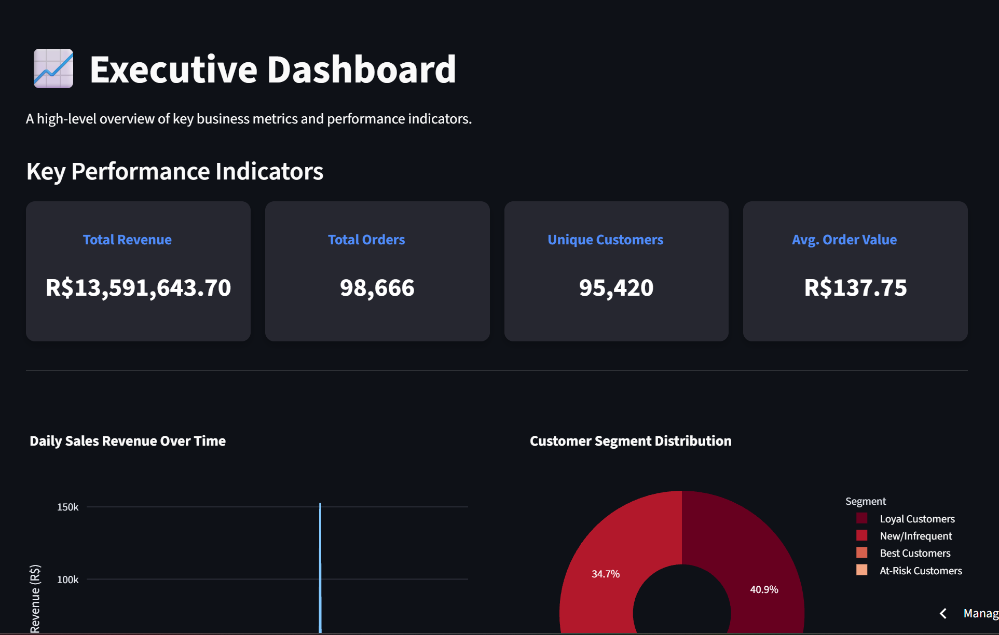
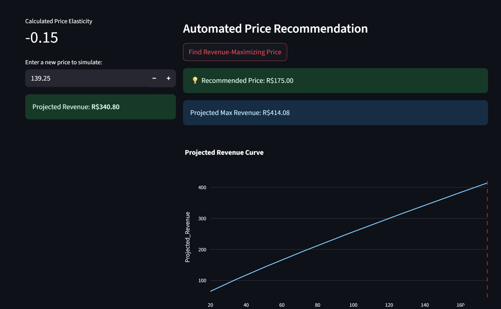
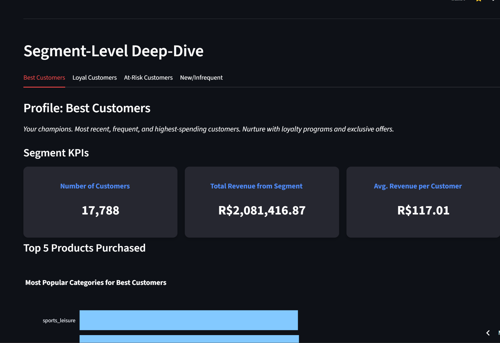
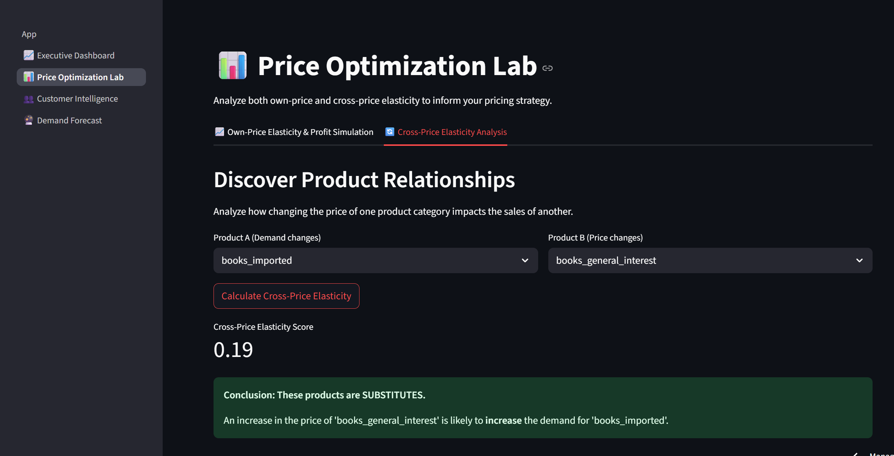
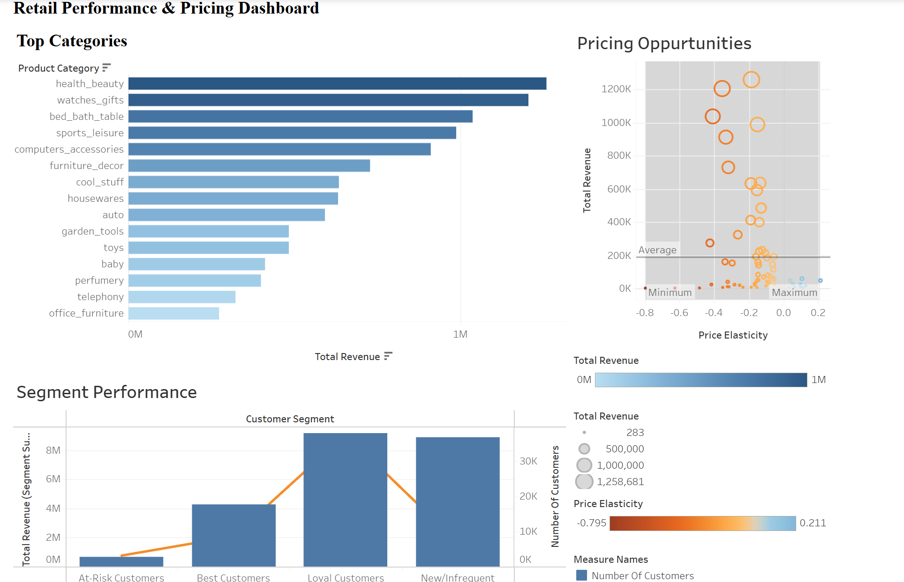

# Dynamic Pricing & Retail Analytics Engine

<p align="center">
  <em>An end-to-end data science application that transforms raw sales data into a suite of powerful, interactive tools for business intelligence and predictive analytics.</em>
</p>

<!-- INSTRUCTIONS: Place your 'dashboard.png' screenshot in the 'docs/images' folder. -->
<p align="center">
  
</p>

---

### 🚀 Live Demonstrations

*   **Live Streamlit Application:** [**Click here to view the live app**] https://dynamicpricingretail-wptjwk9uswhjzgqcekjg2f.streamlit.app/ 

*   **Live Tableau Dashboard:** [**Click here to view the live dashboard**]https://public.tableau.com/app/profile/sankalp.singh5474/viz/Book1_17535658131970/Dashboard1 ---

---

### 📝 Project Summary & Purpose

In the competitive retail landscape, setting the optimal price for products is a critical challenge. Static pricing strategies often fail to adapt to market dynamics, leading to lost revenue and inefficient inventory management. This project tackles this problem by building a comprehensive, end-to-end analytics platform that provides data-driven answers to crucial business questions.

The core of this project is a robust **data pipeline** that ingests raw, relational sales data, cleans it using Python and Pandas, and structures it within a **local MySQL database**. This "Data Factory" then serves as the foundation for all subsequent analysis. Advanced machine learning models are used to perform **RFM customer segmentation**, **time-series demand forecasting**, and **price elasticity modeling**.

The final output is not just a report, but a suite of live, interactive tools. A **deployed Streamlit application** serves as the primary interface, allowing users to explore customer behavior, simulate the revenue impact of price changes, and receive AI-driven price recommendations. For high-level reporting, key insights are also aggregated and presented in a polished **Tableau dashboard** suitable for executive stakeholders.

---

## ✨ Key Features & Screenshots

### Profit Forecasting & Price Recommendation
This feature empowers users to simulate price changes and see the projected impact on demand and revenue in real-time. The "Automated Recommendation" button runs hundreds of scenarios to find the optimal price that maximizes revenue within a realistic range.

<!-- INSTRUCTIONS: Place your 'simulator.png' screenshot in the 'docs/images' folder. -->
<p align="center">
  
</p>

### Time-Series Demand Forecasting
Using Facebook's Prophet library, this tool forecasts future sales revenue for the entire business or for specific product categories, providing valuable insights for inventory and financial planning.

<!-- INSTRUCTIONS: Place your 'forecast.png' screenshot in the 'docs/images' folder. -->
<p align="center">
  
</p>

### RFM Customer Segmentation Deep-Dive
Instead of just viewing customers as a monolith, the application uses RFM analysis and K-Means clustering to segment them into actionable groups like "Best Customers," "Loyal," and "At-Risk," complete with KPIs and behavioral summaries.

<!-- INSTRUCTIONS: Place your 'segments.png' screenshot in the 'docs/images' folder. -->
<p align="center">
  
</p>

### Cross-Price Elasticity Analysis
A sophisticated tool that moves beyond single-product analysis to discover hidden relationships between products, identifying whether they behave as **Substitutes** (competitors) or **Complements** (bought together).

<!-- INSTRUCTIONS: Place your 'cross_price.png' screenshot in the 'docs/images' folder. -->
<p align="center">
  
</p>

### Executive BI Dashboard in Tableau
For high-level, at-a-glance reporting, a summary of the key insights is presented in a polished and interactive Tableau dashboard, suitable for business stakeholders.

<!-- INSTRUCTIONS: Place your 'tableau.png' screenshot in the 'docs/images' folder. -->
<p align="center">
  
</p>

---

## 🛠️ Tech Stack

<p align="left">
  
  
  
  
  
  
  
  
</p>

---

## 📂 Project Structure

The project is organized into a modular structure that separates the data processing backend, analysis code, and the frontend application.

dynamic_pricing_retail/
│
├── config/ # Configuration files (e.g., config.ini.template)
├── data/
│ ├── raw/ # Original, untouched CSV data files
│ └── exports_for_tableau/# Aggregated CSVs ready for Tableau
├── docs/
│ └── images/ # Screenshots for the README
├── scripts/
│ ├── 1_run_etl.py # Cleans and loads data into local MySQL
│ ├── 2_run_analysis... # Runs analysis and updates local MySQL
│ └── 3_create_parquet... # Exports final data for the app
├── src/
│ ├── analysis/ # All analytical functions (elasticity, etc.)
│ ├── data_processing/ # Data loading and cleaning functions
│ └── database/ # Database connection utility
├── streamlit_app/
│ ├── App.py # The main landing page of the Streamlit app
│ ├── assets/ # CSS files and app images
│ ├── components/ # Reusable UI components (plots, cards)
│ ├── data/ # The final Parquet data file for the app
│ └── pages/ # Each .py file is a separate page in the app
├── .gitignore
├── README.md
└── requirements.txt


---

## ⚙️ How to Reproduce Locally

Follow these steps to set up the "Data Factory" and run the application on your own machine.

**Prerequisites:**
*   Python 3.9+
*   MySQL Server

**1. Clone the Repository & Set Up Environment**
   ```bash
   git clone https://github.com/sankalp250/dynamic_pricing_retail.git
   cd dynamic_pricing_retail
   python -m venv .venv
   # Activate the environment (.venv\Scripts\activate for Windows)
   source .venv/bin/activate
   pip install -r requirements.txt

2. Set Up the Local MySQL Database

   Log in to your MySQL client, then create the database and a dedicated user.
    Update the config/config.ini.template file with your credentials and rename it to config.ini.

3. Run the Full Data Pipeline

    Place the Olist dataset CSV files into the data/raw/ directory.
    Run the scripts in order to process the data and create the final file for the app:
    * Step 3.1: ETL - Cleans data and loads it into your local MySQL.  

    python scripts/1_run_etl.py

     *   **Step 3.2: Analysis** - Runs segmentation and updates the local MySQL table.
   ```bash
   python scripts/2_run_analysis_and_export.py
   ```
 *   **Step 3.3: Export** - Creates the final `.parquet` data file for the Streamlit app to use.
   ```bash
   python scripts/3_create_parquet_export.py
   ```

4. Launch the Streamlit Application

    streamlit run streamlit_app/App.py

The application will now be running locally in its self-contained, high-performance mode.

☁️ Deployment

The Streamlit application is deployed on Streamlit Community Cloud, connected directly to this GitHub repository. The deployment is configured in a self-contained mode, reading from the master_data.parquet file. This architecture was chosen to ensure maximum reliability and speed for the public-facing application.