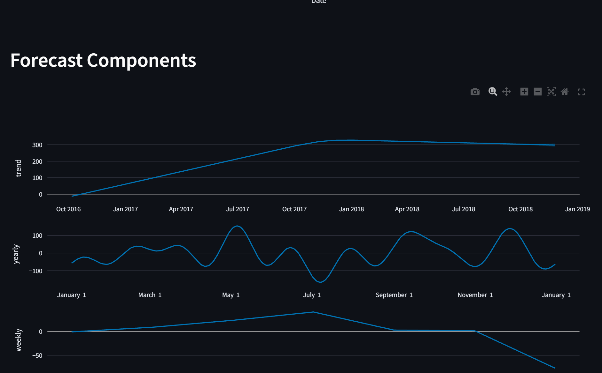

# Dynamic Pricing & Retail Analytics Engine

  <em>An end-to-end data science application that transforms raw sales data into a suite of powerful, interactive tools for business intelligence and predictive analytics.</em>

<!-- INSTRUCTIONS: Place your 'dashboard.png' screenshot in the 'docs/images' folder. -->

  

---

### 🚀 Live Demonstrations

*   **Live Streamlit Application:** [**Click here to view the live app**] https://dynamicpricingretail-wptjwk9uswhjzgqcekjg2f.streamlit.app/ 

*   **Live Tableau Dashboard:** [**Click here to view the live dashboard**]https://public.tableau.com/app/profile/sankalp.singh5474/viz/Book1_17535658131970/Dashboard1 ---

---

### 📝 Project Summary & Purpose

In the competitive retail landscape, setting the optimal price for products is a critical challenge. Static pricing strategies often fail to adapt to market dynamics, leading to lost revenue and inefficient inventory management. This project tackles this problem by building a comprehensive, end-to-end analytics platform that provides data-driven answers to crucial business questions.

The core of this project is a robust **data pipeline** that ingests raw, relational sales data, cleans it using Python and Pandas, and structures it within a **local MySQL database**. This "Data Factory" then serves as the foundation for all subsequent analysis. Advanced machine learning models are used to perform **RFM customer segmentation**, **time-series demand forecasting**, and **price elasticity modeling**.

The final output is not just a report, but a suite of live, interactive tools. A **deployed Streamlit application** serves as the primary interface, allowing users to explore customer behavior, simulate the revenue impact of price changes, and receive AI-driven price recommendations. For high-level reporting, key insights are also aggregated and presented in a polished **Tableau dashboard** suitable for executive stakeholders.

---

## ✨ Key Features & Screenshots

### Profit Forecasting & Price Recommendation
This feature empowers users to simulate price changes and see the projected impact on demand and revenue in real-time. The "Automated Recommendation" button runs hundreds of scenarios to find the optimal price that maximizes revenue within a realistic range.

<!-- INSTRUCTIONS: Place your 'simulator.png' screenshot in the 'docs/images' folder. -->

  

### Time-Series Demand Forecasting
Using Facebook's Prophet library, this tool forecasts future sales revenue for the entire business or for specific product categories, providing valuable insights for inventory and financial planning.

<!-- INSTRUCTIONS: Place your 'forecast.png' screenshot in the 'docs/images' folder. -->

  

### RFM Customer Segmentation Deep-Dive
Instead of just viewing customers as a monolith, the application uses RFM analysis and K-Means clustering to segment them into actionable groups like "Best Customers," "Loyal," and "At-Risk," complete with KPIs and behavioral summaries.

<!-- INSTRUCTIONS: Place your 'segments.png' screenshot in the 'docs/images' folder. -->

  

### Cross-Price Elasticity Analysis
A sophisticated tool that moves beyond single-product analysis to discover hidden relationships between products, identifying whether they behave as **Substitutes** (competitors) or **Complements** (bought together).

<!-- INSTRUCTIONS: Place your 'cross_price.png' screenshot in the 'docs/images' folder. -->

  

### Executive BI Dashboard in Tableau
For high-level, at-a-glance reporting, a summary of the key insights is presented in a polished and interactive Tableau dashboard, suitable for business stakeholders.

<!-- INSTRUCTIONS: Place your 'tableau.png' screenshot in the 'docs/images' folder. -->

  

---

## 🛠️ Tech Stack

  
  
  
  
  
  
  
  

---

## 📂 Project Structure

The project is organized into a modular structure that separates the data processing backend, analysis code, and the frontend application.